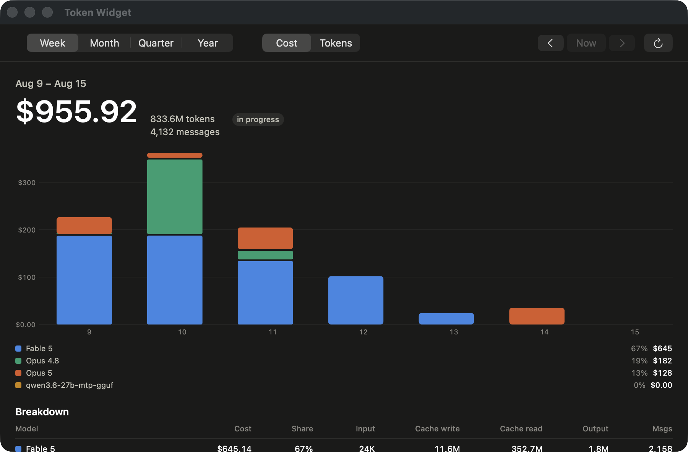

# Token Widget

A macOS desktop widget that charts what you spend on LLM coding agents, read straight from the transcripts they already write to disk. No API keys, no account linking, nothing leaves your machine.



## Install

```sh
git clone https://github.com/EricBriscoe/token-widget.git
cd token-widget
./install.sh
```

The script checks for Xcode, installs XcodeGen with Homebrew if it's missing, detects your Apple Developer team from your keychain, builds a Release binary, installs it to `~/Applications`, and launches it. It takes about a minute on a clean checkout.

You need macOS 14 or later and an Apple ID added to Xcode under Settings > Accounts. A free account works. Signing is required because the app and the widget exchange data through an App Group, and App Group IDs are prefixed with a team ID.

### Adding the widget

1. Control-click an empty area of the desktop and choose **Edit Widgets**, or click the clock in the menu bar and scroll to the bottom
2. Search for **Token Widget**
3. Drag out Small, Medium, Large, or Extra Large
4. Control-click the placed widget and choose **Edit Widget** to set the range and whether it shows cost or tokens

Four ranges are available, each bucketed so the bar count stays readable: week by day, month by day, quarter by week, year by month. The arrows on the widget step backwards through periods.

Keep the app running, or tick "Open at login" in its window. The widget is sandboxed and only reads the aggregated snapshot, so it shows whatever the app last recorded.

## Where the numbers come from

Claude Code writes one JSONL file per session under `~/.claude/projects/`. Every assistant message carries a `usage` block with input, output, cache-write and cache-read token counts, the model, and a timestamp. Token Widget reads those files and nothing else.

Three details make the difference between a plausible number and a correct one.

**Deduplication.** Claude Code writes one JSONL line per content block and repeats the full `usage` block on each. One message in my own logs appears 15 times. On a 340-file corpus the raw logs held 44,470 usage lines for 19,001 distinct messages, so counting lines instead of messages inflates every figure by about 2.3x. Records are keyed on `messageId` plus `requestId`, which is also what deduplicates a session that gets resumed or forked into a sidechain.

**Cache tiers priced separately.** A cache write bills at 1.25x the input rate on the 5-minute TTL and 2x on the 1-hour TTL; a cache read bills at 0.1x. The transcripts record `ephemeral_5m_input_tokens` and `ephemeral_1h_input_tokens` separately, so the two are never merged. On a cache-heavy workload the cache lines dominate the bill: in the screenshot above, 352.7M cache-read tokens account for most of Fable 5's $645.

**Thinking tokens aren't added twice.** `output_tokens_details.thinking_tokens` is a subset of `output_tokens`. It's tracked for display and excluded from the billed total.

Two kinds of entry are deliberately excluded or zeroed. Messages with the model `<synthetic>` are placeholders the CLI writes when an API call fails, so they never reach the cost math. Models served locally, identified by a `org/model` style ID, chart their tokens but cost nothing.

If a model has no published rate, its cost reads as zero and the app names it in the footer and the breakdown table. A missing rate is never quietly rendered as free usage.

### Prices

Rates come from Anthropic's published list prices, per million tokens:

| Model | Input | Output |
|---|---|---|
| `claude-fable-5` | $10 | $50 |
| `claude-opus-5` | $5 | $25 |
| `claude-opus-4-8`, `claude-opus-4-7`, `claude-opus-4-6` | $5 | $25 |
| `claude-sonnet-5` | $2 through 2026-08-31, then $3 | $10, then $15 |
| `claude-sonnet-4-6` | $3 | $15 |
| `claude-haiku-4-5` | $1 | $5 |

Prices are applied per day, so Sonnet 5's introductory pricing is billed correctly on either side of the 31 August cutover rather than retroactively repricing older days. Fast mode on Opus 5 is priced separately at $10/$50. Server-side web search bills at $10 per 1,000 requests and is read from `server_tool_use.web_search_requests`.

## History outlives the transcripts

Claude Code deletes its own transcripts after a retention period, 30 days by default. Token Widget folds each scan into a stored snapshot and keeps the aggregated days after their source files are gone, so the chart keeps reaching further back the longer the app stays installed. A year of history is roughly 100 KB.

Because those days often become the only surviving record, a few things are deliberate:

- Every save rolls the current snapshot to `snapshot.previous.json` first
- A snapshot the app can't parse, including one written by a newer version, stops the scan instead of being replaced by whatever transcripts remain
- **Rebuild History from Transcripts** asks for confirmation and names how many days it will discard, and **Restore Previous History** undoes it
- **Export History** and **Import History** move the record between machines; importing keeps the fuller record for any day both files describe rather than summing them

The one gap this can't close: the app has to scan at least once inside the retention window to capture a given day. Ticking "Open at login" is what keeps that true.

## Performance

A first scan reads every transcript. On 340 files and 404 MB that takes 2.5 seconds. After that each file's size, modification date, inode, and byte offset are recorded, so a rescan opens only files that grew and reads only the bytes appended since. A rescan with nothing new takes 0.04 seconds.

Files being written to right now usually end mid-line. The reader stops at the last complete newline and leaves the fragment for the next pass, so a half-written JSON object is never parsed.

The dedup index stores 64-bit hashes rather than the identity strings: 8 bytes per message, about 150 KB for 19,000 messages, against roughly 3 MB for the same identities as text.

## Layout

```
Core/     Swift package: parsing, pricing, aggregation, storage, charts
App/      SwiftUI host app, FSEvents watching, scan driver
Widget/   WidgetKit extension and its configuration intents
```

The app is not sandboxed because it reads `~/.claude`. The widget is sandboxed and can only reach the App Group container. Everything they both need, including the chart itself, lives in `Core` so the two can't disagree about a total.

`Core` also builds a command-line tool:

```sh
cd Core && swift run tokenusage week
```

It prints the same figures with an ASCII bar chart, which is the quickest way to check the engine against your raw logs. It carries no entitlements, so it keeps its own store under `~/Library/Application Support/TokenWidget` and can't disturb the app's history.

### Building without the install script

```sh
xcodegen generate
xcodebuild -project TokenWidget.xcodeproj -scheme TokenWidget -destination 'platform=macOS' build
cd Core && swift test
```

To build under your own Apple Developer team, change `DEVELOPMENT_TEAM` in `project.yml`. The entitlements use `$(TeamIdentifierPrefix)`, which Xcode expands at build time, and the Swift code reads its App Group from its own entitlements at runtime, so there's no team ID hardcoded in source.

## Chart design

Series colours come from an eight-hue categorical palette validated for colour-vision deficiency: every adjacent pair clears ΔE 8 in OKLab under protanopia, deuteranopia, and tritanopia, in both light and dark mode. Three of the light-mode hues fall below 3:1 contrast against the surface, so every chart also ships the values as text in the legend and the breakdown table. Identity never rests on hue alone.

A model keeps its colour across every range and period. The palette is assigned from every model in the snapshot rather than the ones currently visible, so changing the date range never repaints a series you've already learned.

## Limits

The Codex reader is written against Codex's documented rollout format and **has not been checked against real transcripts**, because this machine has `~/.codex` but no recorded sessions. It's strict on purpose: anything it doesn't recognise is skipped, so an unexpected format shows up as no Codex usage rather than as wrong numbers. If you use Codex, check its figures against your logs before trusting them, and open an issue with a sample line.

Cost is computed from published list prices. It's what the usage would cost at those rates, not a bill. Subscription plans, negotiated discounts, and promotional credits aren't modelled.

## License

MIT. See [LICENSE](LICENSE).
